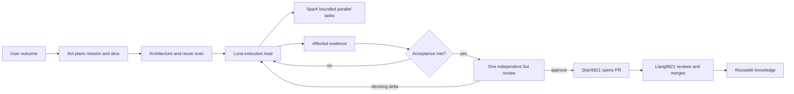

# Adaptive governance architecture

## Design goal

Help a researcher-engineer reach the correct result quickly while leaving
maintainable code, trustworthy evidence, review history, and reusable knowledge.
The system optimizes `time_to_correct_decision` first, then token/call cost. It
does not optimize for ceremony, maximum test volume, or a perfect-looking PR.

## Thin kernel

The default path contains only seven decisions:

```text
Outcome -> Slice -> Reuse -> Execute -> Prove -> Review -> Retain
```

1. **Outcome** freezes what success means and what is out of scope.
2. **Slice** chooses one independently useful, reversible milestone.
3. **Reuse** discovers the existing owner before new code is created.
4. **Execute** routes work to the cheapest capable role and relevant tools.
5. **Prove** runs the smallest evidence that can falsify the acceptance claim.
6. **Review** checks the frozen contract once and closes fixes by delta.
7. **Retain** saves only reusable knowledge and removes obsolete rules.

Everything else is an adapter or an optional strict proof layer.

## End-to-end flow



Terra appears only as a recorded execution fallback when Luna is unavailable.
It never silently replaces the required independent reviewer.

## Adaptive profiles

| Profile | Typical work | Evidence | Review | Hook behavior |
|---|---|---|---|---|
| `QUICK` | explanation, inventory, docs, reversible mechanics | direct/targeted | optional | advisory |
| `STANDARD` | normal research engineering and development | affected-first, representative end-to-end when applicable | one independent review | advisory |
| `STRICT` | security/privacy, exact math, public contracts, irreversible changes, hooks/installers/releases | frozen V16 FAST/CANDIDATE/FINAL contracts | fresh risk-routed review, delta continuation | fail-closed integrity gates |

The user or mission selects `STRICT`; a newly discovered high-risk trigger may
upgrade a mission. A missing task receipt cannot manufacture high risk.

## Layers

### 1. Global policy

`codex/AGENTS.md` is the installed thin kernel. It defines communication,
mission sizing, model roles, tool intent, code health, evidence, review,
GitHub identity, knowledge retention, privacy, and completion.

### 2. Project adapters

Repository `AGENTS.md`, formatter/linter/compiler configuration, ownership
documents, architecture decisions, and domain contracts override generic
language defaults. An attached Desktop working directory is context, not proof
of repository ownership.

### 3. Code health

`docs/code-health.md` indexes official Google sources and defines the
`REUSE|EXTEND|NEW` decision. Only task-relevant guidance is loaded. Mechanical
style belongs to formatters, linters, compilers, and static analysis.

### 4. Tool plane

Semble discovers unknown semantic candidates; CodeGraph validates known
structure and impact; `rg` resolves exact literals; `rtk` transports shell
context. A tool call is valid only when its result changes discovery, design,
verification, or review. The execution lead owns one exact-repository repair.

Tool readiness is lazy in `QUICK` and `STANDARD`: verify a tool before relying
on its answer. `STRICT` additionally supports the V16 task-contract, preflight,
usage, receipt, and enforcement chain. A degraded fallback reports lost
coverage and blocks only when the missing fact is essential.

### 5. Execution and evidence

Mission slices are sized by coupling, rollback, and validation cost. Evidence
is affected-first and content-addressed. Reference-parity work freezes the
reference version, configuration, data identity, metric, and tolerance.
Synthetic and representative real-data samples are milestone evidence when the
capability has both domains; reviewers audit evidence rather than recreating it.

The existing V16 FAST/CANDIDATE/FINAL runner remains the strict proof engine.
It is not required for every read, shell command, or small edit.

### 6. Review and GitHub

One reviewer owns the verdict. The initial review receives a compact clean-room
packet. Stable fixes return to the same reviewer with only the finding lineage,
exact delta, new evidence, and direct boundaries. A fresh reviewer is reserved
for explicit escalation triggers.

Qian9921 owns author actions. Liang9921 owns review, approval, and merge. The PR
is the durable record of objective, evidence, feedback, dispositions,
limitations, and exact reviewed head.

### 7. Hooks and installer

Hooks are a reliability plane, not a workflow prison. Adaptive mode records
privacy-safe routing and integrity observations without denying ordinary work
for missing ceremony. Strict mode retains fail-closed V16 proof behavior.

The installer remains manifest-bound, allowlisted, dry-run capable, atomic,
backed up, hash-verified, and rollback-capable. It never copies credentials,
sessions, memories, plugins, connections, model caches, or unrelated files.

## Communication contract

Default user-visible output is bounded to:

```text
Conclusion
Status
Decisive evidence
Remaining risk
Next action
```

Routine tool narration and raw logs remain in artifacts. Long explanations are
reserved for high-risk decisions, failures, or an explicit request.

## Rule lifecycle

Every new rule records:

```text
failure prevented | trigger | owner | advisory/blocking | cost | retirement
```

Rules are reviewed as products. Repeated false blockers, duplicate coverage,
or cost greater than the prevented risk cause downgrade or removal. The thin
kernel has a fixed conceptual budget: a new core rule normally replaces or
merges with an existing one.

## Success metrics

Primary:

- time to first actionable finding;
- time to correct verdict and merge;
- review round count;
- false blocker rate;
- P1 miss count;
- scope reopened count.

Secondary:

- model calls and tokens;
- evidence reuse rate;
- tool repair success and repeated-failure rate;
- communication length and repeated-context rate.

Metrics inform policy changes; they are not approval incentives. Missing data
is `unavailable`, never a synthetic zero.
