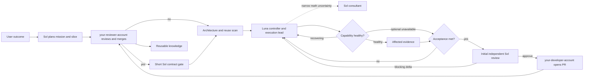

# V21.2 balanced-standard governance architecture

## Persistent semantic gateway

V21.2 extends the existing gateway owner with an owner-private, on-demand
Unix-socket broker. Its namespace is the canonical worktree, Git directory,
Git common directory, and language, so separate MCP stdio client processes
share one live upstream `BackendClient` process and session. Persistent scope
and its atomic manifest live under the XDG cache directory (0700 state/scope
directories and a 0600 socket), never in the repository, Git metadata, or
temporary directories.

Each foreground tools/call applies only the manifest's exact add/edit/delete
delta with temporary-file-plus-rename writes. There is no watcher or background
repository scan. Source/header changes keep the backend PID/session and do not
refresh the build graph. Build refresh runs only for initial build-graph
bootstrap or a changed persisted build-graph hash. After broker death the
manifest and scope remain, but the next response truthfully reports
`reuse_mode=cold_rebuild`; no disk graph persistence is claimed. Backend EOF,
timeout, invalid or empty responses invalidate the live session and return zero
facts with `bounded_exact_evidence` fallback.

V21 is the product policy for ordinary reversible work. The existing `$v19-*`
skill IDs and paths remain stable compatibility APIs; V21 extends their owners
instead of copying or renaming the skills. `codex/v16/**` remains the unchanged
strict compatibility engine and is not the V21 product version.

## Three daily evidence lanes

Daily `QUICK` and `STANDARD` work uses exactly three lanes: Semble discovery for
unknown or similar implementations; the compiler-derived semantic gateway for
known C++/Python symbols and impact; and bounded exact evidence for source,
Git, compiler, build, test, and benchmark facts. CodeGraph, `rg`, and `rtk` are
retained only as explicit V16 `STRICT` compatibility routes. Missing semantic
providers produce `PARTIAL` or `NOT_READY` plus one named exact-evidence
fallback and do not block unrelated STANDARD work.

The gateway is an `EXTEND` of the prior overlay lifecycle and a `NEW` owner for
compiler orchestration because no existing semantic owner exists. It delegates
language facts to clangd/Pyright and uses the pinned `@samchon/graph` identity
(`95e20c9540e85fef542466172484229356d3d0d8`, tree
`e9ce033e380d77265c601579e436218502a6ccbd`). Its receipt freezes repository
HEAD/tree/parent/dirty diff, build inputs, provider versions and binary hashes,
scope/resource limits, generation, and stable-versus-ephemeral identity rules.

## Design goal

Help a researcher-engineer reach the correct result quickly while leaving
maintainable code, trustworthy evidence, review history, and reusable knowledge.
The system optimizes `time_to_correct_decision` first, then token/call cost. It
does not optimize for ceremony, maximum test volume, or a perfect-looking PR.

## Thin kernel

The default path contains only seven decisions:

```text
Outcome -> Slice -> Reuse -> Execute -> Prove -> Review -> Retain
```

1. **Outcome** freezes what success means and what is out of scope.
2. **Slice** chooses one independently useful, reversible milestone.
3. **Reuse** discovers the existing owner before new code is created.
4. **Execute** routes work to the cheapest capable role and relevant tools.
5. **Prove** runs the smallest evidence that can falsify the acceptance claim.
6. **Review** checks the frozen contract once and closes fixes by delta.
7. **Retain** saves only reusable knowledge and removes obsolete rules.

Everything else is an adapter or an optional strict proof layer.

## End-to-end flow



Terra appears only through an explicit, short-lived `TERRA_REPLAN` or
`TERRA_TRIAGE` bridge for bounded R0/R1 advisory synthesis/triage, or as the
separate recorded continuity fallback when Luna is unavailable. A bridge returns
control directly to its Luna parent and cannot review, merge, spawn, listen,
retry, or issue a final verdict. Sol audits recovery evidence; Terra never
silently replaces the required independent reviewer.

The machine-readable role contract is `codex/hooks/model_roles.py`. Nested help
is optional: Sol may delegate bounded mechanical work to Luna, while Luna may
ask Sol one narrow mathematical consultant question. Child scopes only narrow,
the depth is capped at two below the controller, and a branch cannot ping-pong
between Luna and Sol. A consultant in the author lineage is ineligible for the
fresh independent reviewer role.

## Adaptive profiles

| Profile | Typical work | Evidence | Review | Hook behavior |
|---|---|---|---|---|
| `QUICK` | explanation, inventory, docs, reversible mechanics | direct/targeted | optional | advisory |
| `STANDARD` | ordinary reversible research engineering and development | affected-first, representative end-to-end when applicable | one initial review plus at most one delta review | advisory |
| `STRICT` | explicit strict selection by the user only; never inferred from risk or release context | frozen V16 FAST/CANDIDATE/FINAL contracts | fresh risk-routed review, delta continuation | fail-closed integrity gates |

The user explicitly selects `STRICT`; a newly discovered high-risk trigger may
upgrade a mission. A missing task receipt cannot manufacture high risk.

### STANDARD contract

Before execution, freeze the acceptance envelope, time budget, evidence budget,
rollback, and limitation boundary. A blocker is blocking only when it maps to
that envelope and weighs user impact, occurrence likelihood, recoverability,
repair cost, and complexity cost. A theoretical counterexample without that
mapping is `FOLLOW_UP` by default. A known, bounded limitation is a legal
completion state when documented and outside the frozen acceptance.

Run a check only when its result can change the decision. If the time or
evidence budget expires, replan instead of expanding scope silently. The
complexity circuit breaker requires simplification when defensive/recovery
logic exceeds the core feature or consecutive attempts create new state
problems. Review is one initial pass and at most one delta pass; a third round
requires explicit replan.

## Layers

### 1. Global policy

`codex/AGENTS.md` is the installed thin kernel. It defines communication,
mission sizing, model roles, tool intent, code health, evidence, review,
GitHub identity, knowledge retention, privacy, and completion. Conditional
execution, strict proof, and GitHub delivery details live in personal skills;
model-specific role detail lives in personal subagent TOMLs. This keeps the
V21 policy thin while preserving the V19 compatibility IDs without paying the
full workflow cost on every turn.

### 2. Project adapters

Repository `AGENTS.md`, formatter/linter/compiler configuration, ownership
documents, architecture decisions, and domain contracts override generic
language defaults. An attached Desktop working directory is context, not proof
of repository ownership.

### 3. Code health

`docs/code-health.md` indexes official Google sources and defines the
`REUSE|EXTEND|NEW` decision. Only task-relevant guidance is loaded. Mechanical
style belongs to formatters, linters, compilers, and static analysis.

### 4. Tool plane

Semble discovers unknown semantic candidates; CodeGraph validates known
structure and impact; `rg` resolves exact literals; `rtk` transports shell
context. A tool call is valid only when its result changes discovery, design,
verification, or review. In adaptive mode, Luna owns bounded distinct-strategy
exact-repository recovery; explicit `STRICT` V16 retains the one-attempt
controller.

Tool readiness is lazy in `QUICK` and `STANDARD`: verify a tool before relying
on its answer. `STRICT` additionally supports the V16 task-contract, preflight,
usage, receipt, and enforcement chain. A degraded fallback reports lost
coverage and blocks only when the missing fact is essential.

For a large-code mission, the machine contract
`code-mission-tool-index-policy.v1` binds exact repository/worktree/revision
hashes and healthy revision-matching Semble and CodeGraph indexes. Semble
semantic/similar discovery precedes development; CodeGraph structural or
blast-radius evidence precedes `CANDIDATE_READY`. Only pure non-code or exact
mechanical work may use `N/A` with a reason, and the adaptive policy has no
per-turn or call-count quota.

### 4a. Self-healing capability recovery

Capabilities include required tools, libraries, datasets, environments, and
their task-specific access/configuration. `HEALTHY` means the capability is
usable and was exercised by the actual dependent slice. `RECOVERING` means
Luna owns a machine-scheduled bounded next strategy with new evidence.
`DEGRADED` means an explicitly optional capability failed without blocking
unrelated work and has repair debt. The adaptive `tool-recovery.v1` report
records scheduled continuation in `continuation_owner` and `recheck_after_sec`;
that relevant capability is `RECOVERING`, not `DEGRADED`.
`EXTERNAL_WAIT` means a genuinely outside dependency must change and gets
bounded-backoff rechecks;
`USER_ACTION_REQUIRED` is reserved for a scientific/product choice,
credentials/licensing, irreversible/shared-state action, material unapproved
cost, or privacy decision—never a check-only/no-mutation result.
`UNRECOVERABLE` means evidence proves the whole permitted recovery graph is
exhausted and a dependent slice cannot make its claim; one strategy or
controller budget ending only opens that strategy's circuit.

A no-progress strategy is fingerprinted, reported, and not repeated. It ends
that strategy—not the recovery mission: Luna chooses a materially different,
safe evidence-producing strategy. The failed required capability blocks only
its dependent claim/slice; a failed optional one carries owned repair debt.
Normal machine repair remains Luna's execution work.
`QUICK` and `STANDARD` record this proportionately without new hook gates;
explicit `STRICT` uses the separate, unchanged V16 proof chain.

### 5. Execution and evidence

Mission slices are sized by coupling, rollback, and validation cost. Evidence
is affected-first and content-addressed. Reference-parity work freezes the
reference version, configuration, data identity, metric, and tolerance.
Synthetic and representative real-data samples are milestone evidence when the
capability has both domains; reviewers audit evidence rather than recreating it.

The existing V16 FAST/CANDIDATE/FINAL runner remains the strict proof engine.
It is not required for every read, shell command, or small edit.

### 6. Review and GitHub

One reviewer owns the verdict. The initial review receives a compact clean-room
packet. Stable fixes return to the same reviewer with only the finding lineage,
exact delta, new evidence, and direct boundaries, for at most one delta pass.
A third round requires explicit replan; a fresh reviewer is reserved for
contract/risk/scope drift, a large rewrite, incomplete prior coverage, a new P1
counterexample, review-governance changes, or non-convergence.

your-developer-account owns author actions. your-reviewer-account owns review, approval, and merge. The PR
is the durable record of objective, evidence, feedback, dispositions,
limitations, and exact reviewed head.

### 7. Hooks and installer

Hooks are a reliability plane, not a workflow prison. Adaptive mode records
privacy-safe routing and integrity observations without denying ordinary work
for missing ceremony. Strict mode retains fail-closed V16 proof behavior.

The installer remains manifest-bound, allowlisted, dry-run capable, atomic,
backed up, hash-verified, and rollback-capable. It never copies credentials,
sessions, memories, plugins, connections, model caches, or unrelated files.

## Communication contract

Default user-visible output is bounded to three short points or paragraphs,
conclusion first:

```text
Conclusion
Status and evidence
Risk or next action
```

Routine tool narration and raw logs remain in artifacts. Long explanations are
reserved for high-risk decisions, failures, or an explicit request.

## Rule lifecycle

Every new rule records:

```text
failure prevented | trigger | owner | advisory/blocking | cost | retirement
```

Rules are reviewed as products. Repeated false blockers, duplicate coverage,
or cost greater than the prevented risk cause downgrade or removal. The thin
kernel has a fixed conceptual budget: a new core rule normally replaces or
merges with an existing one.

## Success metrics

Primary:

- time to first actionable finding;
- time to correct verdict and merge;
- review round count;
- false blocker rate;
- P1 miss count;
- scope reopened count.

Secondary:

- model calls and tokens;
- evidence reuse rate;
- tool repair success and repeated-failure rate;
- communication length and repeated-context rate.

Metrics inform policy changes; they are not approval incentives. Missing data
is `unavailable`, never a synthetic zero.
